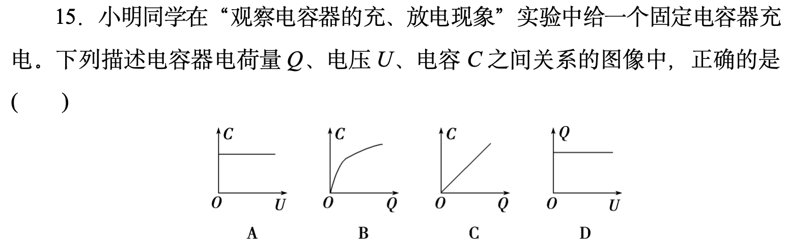
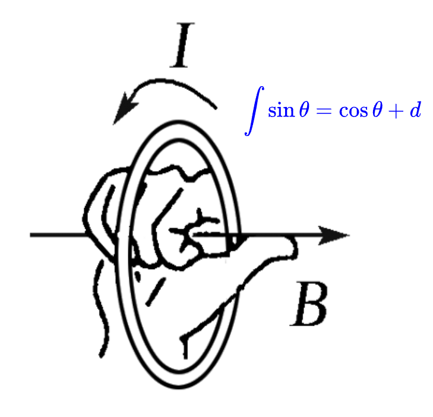
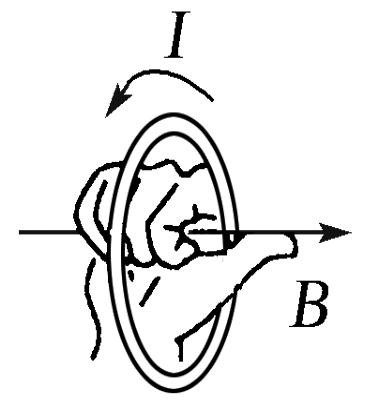
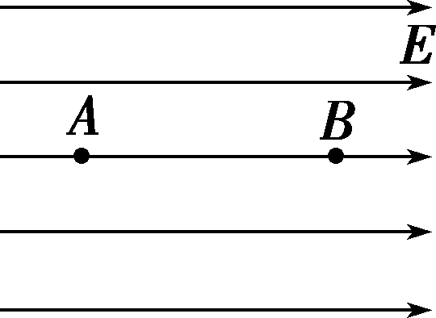
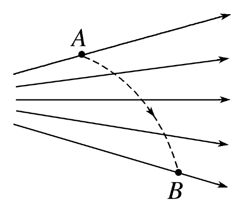
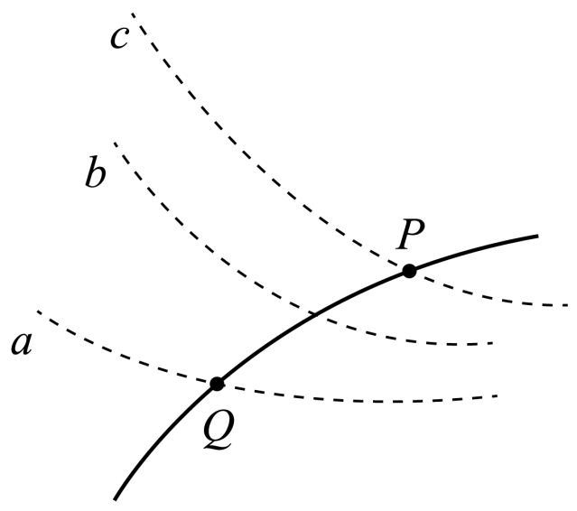

# 测试文本

## 子标题

- *列表项1*
- *列表<u>项2</u>*

A.选项一 
B.选项二 

这是一个<u>**加粗**和*斜体*的_下划线_$\theta$</u>

文本

> [!info] 为什么导出的比例关系 $F\propto\frac{Mm}{r^{2}}$ 中同时包含 $M$ 和 $m$?
>
> 以太阳为参考系，万有引力的表达式为 $F=4\pi^{2}k\frac{m}{r^{2}}$ 以。以地球为参考系，万有引力的表达式为 $F'=4\pi^{2}k'\frac{M}{r^{2}}$
> $k$ 和 $k'$ 是与中心天体质量有关的量（$M$ 隐含在 $k$ 中，$m$ 隐含在 $k'$ 中）

## 双栏格式

:::col|width(25%, 25%, 50%)

@col

colText1

@col

colText2

@col

$$
\int \sin \theta \mathrm{d}\theta=\cos \theta
$$

:::

dfasf<a>fdasf</a>dsfafasdf

<iframe src="https://ggbtool.phycat.cn/front/?id=lxdzaccnsd3&W=800&H=500&E=0&B=1&S=0&P=1&R=0&L=1&F=1&RE=1" width="800" height="500" frameborder="0" scrolling="no" allowfullscreen></iframe>

## 图片

### 标题一

我正在开发<u>obsidian</u>插件，我希望其能够与excalidraw联动，实现以下功能：
将库中给定路径的excalidraw文件导出成png或svg到指定路径

## 物理量关系梳理

:::col|width(61%, 39%)

@col

@col

> [!tip] 电容器
> 1. 电容定义式：$C=\frac{Q}{U}$
> 2. 平行板电容器 (决定式)：$C=\frac{\varepsilon_{r}S}{4\pi kd}$
> 3. 单位：法拉，简称：法，符号为 $\text{F}$
>    - 微法 <u>$1\mu \text{F}=10^{-6}\text{F}$</u>
>    - 皮法 <u>$1 \text{pF}=10^{-12}\text{F}$</u>

:::

> [!info] 强调
> 有一种说法，电势是高中物理中最难的概念。比它更抽象的概念考得没它深，考得更深的概念没它抽象。
>
> 介绍顺序
> 1. 电场中力的性质
> 2. 电场中能的性质
>    - $W_{AB}=-\Delta E_{p}=E_{pA}-E_{pB}$：电场力做功与路径无关只和电荷的初末位置有关。末位置有关。电荷在电场中具有势能，我们称这种形式的能为电势能 $E_{p}$。
>    - $\varphi=\frac{E_{p}}{q}$：电势能除了跟电场有关，还和电荷量有关；但是在确定电场的确定点，电势能和电荷量的比值是一定的。电荷在电场中某一点的电势能与它的电荷量之比，叫作电场在这一点的电势 $\varphi$。
>    - $U_{AB}=\varphi_{A}-\varphi_{B}$：两点间电势的差值叫做电势差。电势依赖零势面，是相对的；而电势差是绝对的。

> [!important] **求电荷在某点的电势能**
> 1. 静电力做功与电势能的关系：$W_{AB}=E_{pA}-E_{pB}$
> 2. 若规定上式中电荷在 $B$ 点的电势能为 $0$，则电荷在 $A$ 点的电势能数值上等于 $W_{AB}$。也就是说，**电荷在某点的电势能，等于把它从这点移动到零势能位置时静电力做的功**。

### 定量计算
#### 快问快答

在某点电荷激发的电场中，一带电量为 $-q$ 的点电荷从无穷远处移动到 $A$ 点，静电力做功为 $W$，求：

1. 该点电荷在 $A$ 点的电势能；
2. $A$ 点的电势。

> [!note]- 答案
> 1. 无穷远处电势为零，点电荷在 $A$ 的电势能等于把它从 $A$ 移动到零势能位置时静电力做功，即 $E_{pA}=-W$
> 2. $\varphi_{A}=\frac{E_{pA}}{-q}=\frac{W}{q}$

#### 练习

电场中有 $A$、$B$、$C$ 三点，一带电量为 $q=-2\times 10^{-9} ;C$ 的点电荷在 $A$ 点的电势能为 $E_{pA}=1.2 \times 10^{-8};J$，将该点电荷从 $A$ 点移动到 $B$ 点，静电力做功为 $W_{AB}=1.8\times 10^{-8};J$，$C$ 点电势为 $\varphi_{C}=-5V$。

1. 求点电荷在 $B$ 点的电势能；
2. 求 $B$ 点的电势；
3. 求 $B$、$C$ 两点间的电势差；
4. 求点电荷从 $B$ 点移动到 $C$ 点的电场力做功。

> [!note]- 答案
> 1. $W_{AB} = E_{pA}-E_{pB} \Rightarrow E_{pB} = E_{pA}-W_{AB}=1.2 \times 10^{-8}-1.8\times 10^{-8}=-6\times 10^{-9};J$
> 2. $\varphi_{B} = \frac{E_{pB}}{q}=\frac{-6\times 10^{-9}}{-2\times 10^{-9}}=3V$
> 3. $U_{BC} = \varphi_{B}-\varphi_{C}=3-(-5)=8V$
> 4. $W_{BC}=qU_{BC}=-2\times 10^{-9} \cdot 8=-1.6\times 10^{-8};J$

### 定性分析

#### 练习

:::col|width(78%, 22%)

@col

如图所示，在匀强电场中，某初速度为零的带电粒子只在电场力作用下从 $A$ 运动到 $B$。则从 $A$ 到 $B$，判断以下物理量的变化情况：电势<u>降低</u>，电场强度<u>不变</u>，粒子动能<u>增大</u>，粒子电势能<u>减小</u>

@col

:::
#### 练习

若实线为电场线，虚线为带电粒子的运动轨迹，带电粒子只受静电力的作用从 $A$ 点向 $B$ 点运动。回答以下问题：

:::col|width(72%,28%)

@col

1. 画出粒子在 $A$ 点的运动方向和加速度方向；
2. 判断粒子的电性；
3. 判断粒子从 $A$ 到 $B$ 过程中，加速度大小和速度大小的变化情况；
4. 判断粒子从 $A$ 到 $B$ 过程中，电势能和电势的变化情况。

@col

:::

#### 练习

如图所示，虚线代表电场中的三个等势面，相邻等势面间的电势差相等。实线为一带负电的质点仅在静电力作用下的运动轨迹，$P$、$Q$ 是这条轨迹上的两点，据此可知 ( <u>B</u> )

:::col|width(70%, 30%)

@col

A. 三个等势面中，$a$ 的电势较低 
B. 带电质点通过 $P$ 点时的电势能较大 
C. 带电质点通过 $P$ 点时的动能较大 
D. 带电质点通过 $Q$ 点时的加速度较大

@col

:::

#### 练习

$$
F_{浮}=\rho_{液}gV_{排}
$$

### 标题二

> [!info] 讲解
> 对物体所受重力按效果进行分解：物体所受重力 $G$ 的两个作用效果，一是使物体沿斜面下滑，二是使物体压紧斜面，这两个分力与合力间遵循平行四边形定则，其大小分别为 $G_{1}＝G \sin \theta，G_{2}＝G \cos \theta$。

#### 练习
题目内容一

